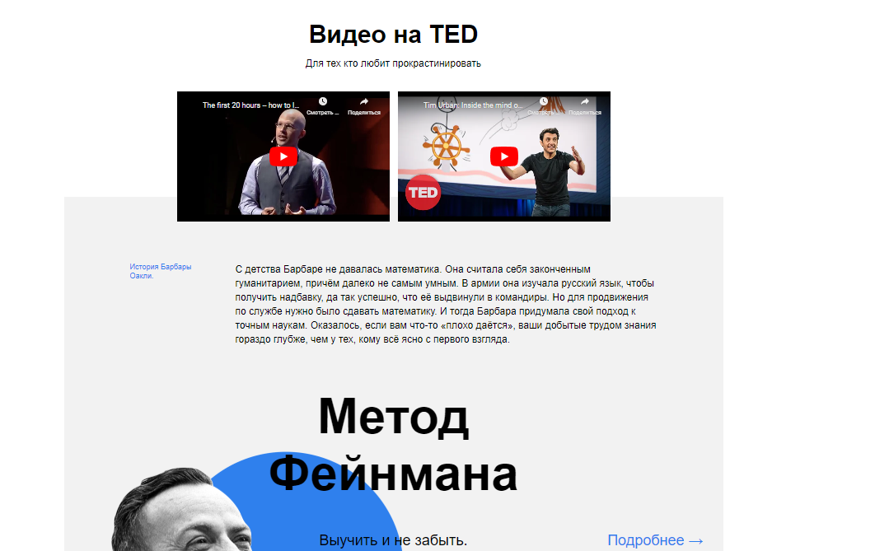
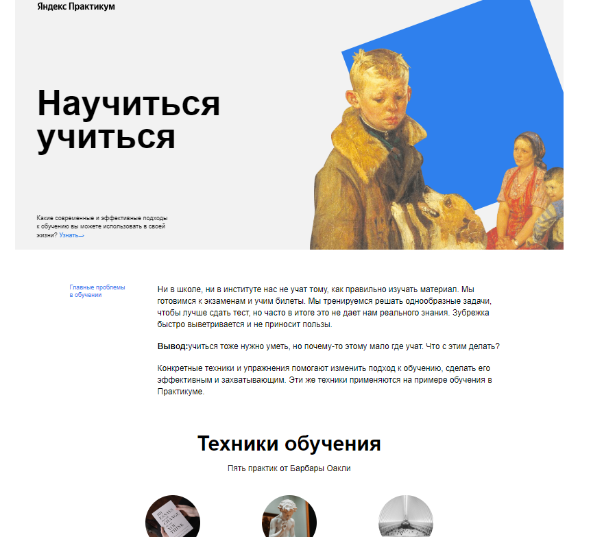

# Проект: How to Learn/Научиться учиться

### Описание проекта

* Мой первый проект, со шпаргалками по обучению

### Используемые технологии

* Работа написана на HTML, CSS
* Структура работы выстроена по БЭМ
* Анимация реализована с помощью keywork
* Также на сайте используются Iframe

### Скриншоты приложения

  
 

###### Ccылка на работу

* https://andrey-kordik.github.io/how-to-learn/

